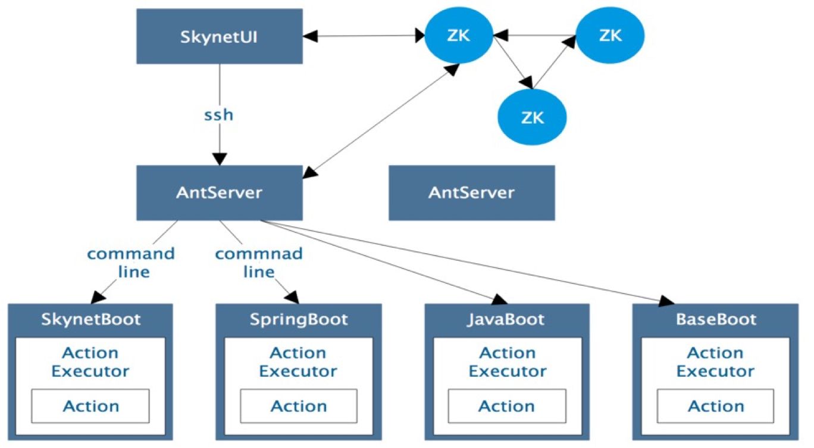

# 1.2 系统架构

### 逻辑架构

### 物理架构

* **AntServer（xAgent）：** 服务的部署、启动、守护、健康、日志（性能）采集等
* **AntWorker（ActionBoot）：**具体的第三方Boot服务，SkynetBoot、SpringBoot、BaseBoot
* **运维管理门户**：skynet分部署处理平台管理界面，包括配置服务、日志服务、管理服务和监控服务

### 启动流程

* **xManager**：集群管理界面，负责服务器的启动与关闭，服务的分配与去除
* **ZooKeeper集群**：集群数据存储节点，负责存储平台的相关数据

### 主要功能

* **服务定义**：定义服务系统变量，启动参数等信息
* **服务分配**：包括服务注册与服务编排，主要是对服务器进行服务分配，可以配置分配的服务实例数
* **服务启动**：部署文件监控，文件更新后进行服务更新，可以进行集群级别、服务器级别、服务级别的启动与停止
* **服务监护**：托管到平台的服务具备服务守护功能，服务崩溃时会自动进行拉起，并且具备健康监测、日志采集、状态查看等功能，方便对服务进行监控以及问题定位
* **服务发现**：可以通过ZK上的节点以及SpringCloud里的Eureka进行服务发现，Eureka注册服务为可选功能，可以通过配置来决定是否启用
* **服务网关**：skynet平台具备服务网关功能，可以对服务进行负载调用

