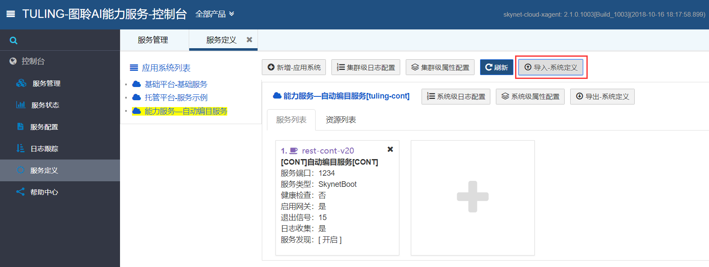

# 2.2 服务定义

## 1. 功能说明

服务定义功能是将服务的相关运行配置，注册配置到集群。通过点击控制台下面的服务定义，进入到服务定义页面。下面是页面显示，左侧是应用系统列表，右侧是服务定义列表


## 2. 功能详细

### 2.1 应用系统

应用系统，相当于plugin组件，每个应用系统，包含一个或多个服务定义

在页面上点击“新增应用系统”，弹出新增应用系统弹出框


在弹出框里填写新增应用系统信息，包括系统名称、系统标题、系统描述和系统版本，**这四个字段默认都是必填。**


点击保存后，可以在左侧应用系统列表里面，看到刚刚添加的“能力服务-自动编目服务”，右侧是该应用系统的服务列表和资源列表，其中，资源列表是该应用系统下所有服务共用


可以通过点击浏览文件，对小于100MB的文件进行上传。对于超过100MB的文件，建议使用FTP/SCP方式，将文件放到资源文件目录，如果资源目录不存在，则新建


上传完成之后，资源列表下面会显示上传的资源文件


### 2.2 服务定义

服务定义，是应用系统下的具体服务，在左侧点击选择应用系统，点击“+”，进入新增服务页面。新增服务设置项较多，下面对其进行一一介绍


#### 2.2.1 基本信息：

基础信息里面填写服务信息，其中服务名称、服务标题、服务描述和服务类型为必填项，服务类型有以下4种：

* **SkynetBoot：**按照skynet开发规范开发的服务，主要指的是各种能力服务以及一些基础服务
* **SpringBoot：**利用SpringBoot技术封装的工程，以SpringBoot方式进行启动
* **JavaBoot：**能够启动的java工程，以jar包方式进行启动
* **BaseBoot：**能够使用命令进行启动的任意进程

服务端口可以设置，设置为0，表示端口随机


#### **2.2.2 运行参数**

主要设置服务的运行参数，包括服务名称，并发数等


#### **2.2.3 环境变量**

如引擎服务系统环境设置，运行资源库加载等


#### **2.2.4 健康检查**

可以选择是否打开，开启后选择健康检测路径、检测间隔等，如达到一定的失败次数，认为此服务僵死，将直接KILL服务进程。（如果实际的服务不存在，有另外的机制保障不检测了）


#### **2.2.5 文件更新**

可以选择启动或者关闭，选择开启时，选择下载目标路径以及**应用系统里上传的资源文件。**服务启动后，会自动将文件下载拷贝到设置的目标路径，并对文件解压授权。此项功能变相实现了服务的自动更新部署


#### 2.2.6 属性设置

设置服务用到的属性配置信息，以 KEY=VALUE 形式，配置规则与application.properties一致，如数组

```coffeescript
ips[0]=192.168.83.203
ips[1]=192.168.83.204
```

上面是全局属性设置，下面是该服务属性设置


#### **2.2.7 日志配置**

配置服务的日志级别，格式：命名空间=INFO\|DEBUG\|ERROR

上面是全局日志配置，下面是服务日志配置


#### **2.2.8 变量与示例**

最后是一些常用变量的示例说明，为变量设置提供参考


点击保存后，可以在页面上看到我们刚刚定义的服务


## 3. 定义导入与导出

除了新增应用系统与服务定义外，还可以通过导入与导出的方式，直接对系统进行定义

### 3.1 系统定义导出

在左侧应用系统列表下，选择需要进行导出操作的应用系统，点击“导出—系统定义按钮，导出该应用系统的所有配置


导出的配置文件如下所示，将{CLUSTER\_NAME}替换为集群名称（一般为skynet），然后就得到了选中应用系统的配置，可以通过导入的方式直接新增该应用系统和其下面的服务定义


### 3.2 系统定义导入

点击“导入—系统定义”，弹出文件选择框



点击“浏览文件”，选择需要导入的配置文件


导入完成后，可以看到新导入的应用系统以及服务


如果导入的配置里面绑定了资源，还要将相应的资源拷贝到设置的路径里面


