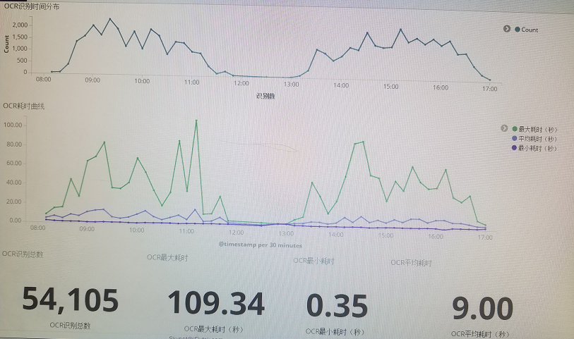

# 3.7.2 日志管理

## 1. 组件功能

 日志组件提供日志的记录功能，与业界标准的日志组件的区别是， 对**日志进行了对象化输出**，并利用业界标准log组件本地输出（log4j或logback） 和 skynet自定义网络输出（输出到ELK）。

> 日志对象化数据包括：

```java
public String trackId;
public LogLevel level;
public String action;
public String context;
public float ctxNum;
public String tag;
public String tag2;
public Throwable error;
​public String host;
​public String ip;
public int pid​
public long tid;
public long timestamp;
```

## 2. 组件说明

  AntLogger的常用方法：

```java
public class AntLogger {
	public static AntLogger getLogger(@SuppressWarnings("rawtypes") Class clazz);

    public void errorf(String format, Object... args); 
	public void error(String errMessage); 
	public void error(String trackId, String errMessage);
	public void error(String trackId, String errMessage, String tag); 
	public void error(Object context, Throwable t); 
	public void error(String trackId, Object context, Throwable t);
	public void error(Object context, Throwable t, String tag); 
	public void error(String trackId, Object context, Throwable t, String tag) ;
	public void error(String trackId, Object context, Throwable t, String tag, String tag2);

	public void infof(String format, Object... args);
	public void info(Object context) ;
	public void info(Object context, String tag);
	public void info(String trackId, Object context, String tag);
	public void info(String trackId, Object context, String tag, String tag2) ;

	public void logf(String format, Object... args); 
	public void log(Object context, String tag); 
	public void log(String trackId, Object context, String tag);
	public void log(String trackId, Object context, String tag, String tag2); 

	public void warnf(String format, Object... args);
	public void warn(String trackId, Object context); 
	public void warn(String trackId, Object context, String tag);

	public void debugf(String format, Object... args);
	public void debug(Object context);
	public void debug(Object context, String tag);
	public void debug(String trackId, Object context, String tag);
	public void debug(String trackId, Object context, String tag, String tag2);
 
	public boolean isDebugEnabled(); 
	public boolean isInfoEnabled(); 
	public boolean isErrorEnabled();
	public boolean isWarnEnabled();
    
	/**
	 * 设置当前线程的 trackId
	 * 
	 * @param trackId
	 *            当前线程的 trackId
	 */
	public static void setCurrentThreadTrackId(String trackId);

	/**
	 * 获取当前线程的 trackId
	 * 
	 * @return 获取当前线程的 trackId
	 */
	public static String getCurrentThreadTrackId();
}
```

与业界标准的日志组件多了 log接口方法，这log的使用场景是 **探针记录**，（如记录 处理耗时，通过tag 过滤在ELK中进行统计），它不受日志级别影响。

如在OCR识别服务中通过探针记录可以在ELK中绘制出如下的图表：




## 3. 调用示例

 使用示例代码

```java
@RunWith(SpringJUnit4ClassRunner.class)
@SpringBootTest(classes = AntloggerApp.class)
public class AntloggerTest {

	AntLogger logger = AntLogger.getLogger(AntloggerTest.class);

	@Test
	public void testError() throws InterruptedException {
		logger.error("errMessage");
		logger.error("trackId", "testErrorStringString");
		logger.error("trackId", "testErrorStringString", "tag");
		logger.error("trackId", "testErrorStringString", "tag");
		logger.error(new Object(), new Throwable("Throwable"));
		logger.error("trackId", new Object(), new Throwable("Throwable"));
		logger.error(new Object(), new Throwable("Throwable"), "tag");
		logger.error("trackId", new Object(), new Throwable("Throwable"), "tag");
		logger.error("trackId", new Object(), new Throwable("Throwable"), "tag", "tag2");

		logger.debug("-- test error end -------");
	}

	@Test
	public void testInfoStringObjectArray() {
		fail("Not yet implemented"); // TODO
	}

	@Test
	public void testInfoObject() {
		logger.info(new Object());
		logger.info(new Object(), "tag");
		logger.info("info message");
		logger.infof( "info message format %s", "args");
		logger.info("trackId", "info message", "tag");
		logger.info("trackId", "info message", "tag", "tag2");
	}

	@Test
	public void testLogObjectString() {
		logger.log("log context", "tag");
		logger.log("trackId", "log message", "tag");
		logger.log("trackId", "log message", "tag", "tag2");
	}

	@Test
	public void testWarn() {
		logger.warn("trackId", "context");
		logger.warn("trackId", "warm message", "tag");
		logger.log("trackId", "log message", "tag");
		logger.info("trackId", "info message", "tag");
		logger.debug("trackId", "debug message", "tag");
		logger.error("trackId", new Object(), new Throwable("Throwable"), "tag");
		logger.warn("trackId", "warm message", "tag");
	}

	@Test
	public void testDebugObject() {
		logger.debug(new Object());
		logger.debug(new Object(), "tag");
		logger.debug("debug message");
		logger.debugf("trackId", "debug message format %s", "args");
		logger.debug("trackId", "debug message", "tag");
		logger.debug("trackId", "debug message", "tag", "tag2");
	}

	@Test
	public void testIsEnabled() {
		Assert.assertTrue(logger.isDebugEnabled());
		Assert.assertTrue(logger.isInfoEnabled());
	}

	@Test
	public void testCurrentThreadTrackId() {
		String trackId = "threadId";
		AntLogger.setCurrentThreadTrackId(trackId);
		assertEquals(trackId, AntLogger.getCurrentThreadTrackId());
	}
}
```


## 4. 实现原理

## 5. 其他

在skynet-cloud里面日志级别设置：

集群范围：/skynet/setting/\_logger

插件范围：/skynet/plugin/{插件}/setting/\_logger

添加：命名空间=日志级别。

如：


插件范围配置日志级别 优先级高于集群范围。


具体命名空间的日志级别可以通过 http://{ip:port}/loggers查看。

如果采用SpringCloud（ Eureka），可以通过 SpringCloudAdmin Logging 查看和修改（一般是临时调试）。

